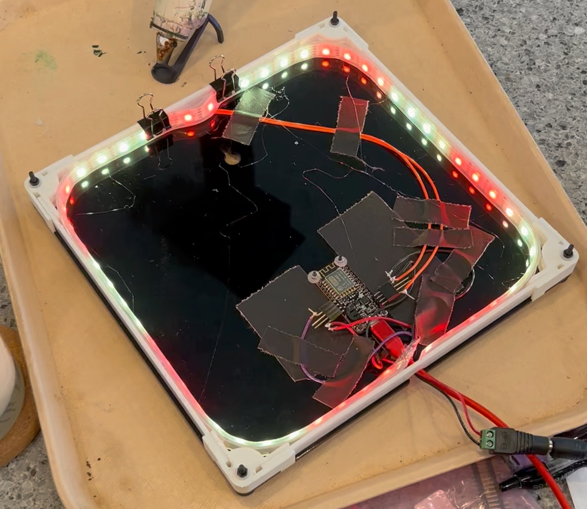
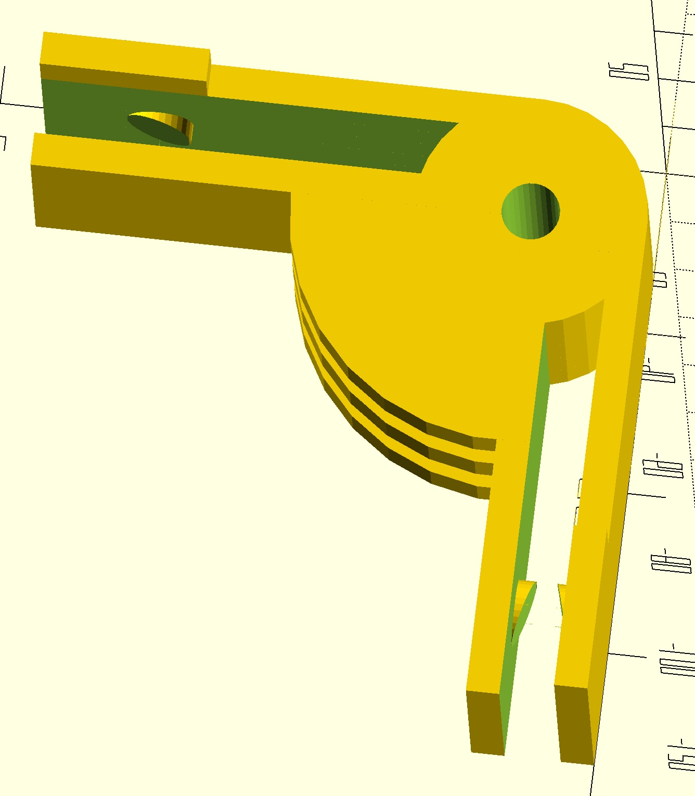
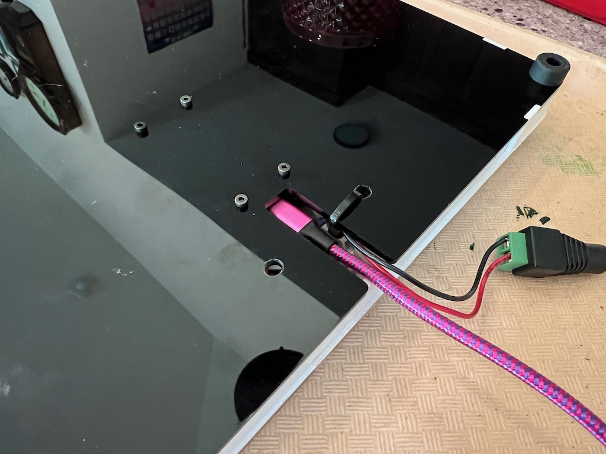

# QR Panel


## Overview

I recently ran across [a photo meme](https://www.reddit.com/r/DidntKnowIWantedThat/comments/kwxd3a/i_have_this_qr_code_sitting_behind_me_in_zoom/) which I guess has been kicking around for a couple of years, but was new to me. It shows off a QR code that, when scanned, turns in a table lamp sitting next to it. The person posting it mentioned it's in the background of video calls. I'm on a lot of video calls, and thought this would be an interesting project to re-make.

My QR panel is a self-contained unit that only needs power and WiFi. There are multicolor LEDs inside that shine through the QR code. When scanned, it takes you to a website that picks two random colors for you, and then sends those colors over an IoT MQTT queue to the panel. The panel then does a little 5-second spinny animation with those colors. With only 8 colors to choose from, the combinations aren't infinite, but are large enough (`8 choose 2 == 56`) for you to verify that you were the one that kicked off the animation.

This work is copyright 2022 by [Brian Enigma](https://github.com/BrianEnigma). It is licensed under a <a rel="license" href="http://creativecommons.org/licenses/by-nc-sa/3.0/">Creative Commons Attribution-NonCommercial-ShareAlike 3.0 Unported License</a>.

## Prior Work

This is based on some earlier work I did with the [Adafruit Feather Huzzah](https://www.adafruit.com/product/2821) and AWS IoT message queues. [You can find that work on my blog.](https://netninja.com/2022/08/11/using-the-adafruit-feather-huzzah-with-aws-iot/)

## Target Audience

This is presented mainly as a code repo of the physical pieces (laser cut and 3D printed), Feather firmware, and cloud software that went into this device. There is not a lot of hand-holding or instruction. The target audience has access to a laser cutter and 3D printer, knows how to solder, can program an Arduino-like device, and knows their way around the AWS control panel. While the blog post linked to in the “Prior Work” section, above, does a lot of hand-holding, this one does not.

## Bill of Material

- [Feather Huzzah](https://www.adafruit.com/product/2821)
- [NeoPixel string](https://www.adafruit.com/product/1138?length=1) (mine ended up being 52 LEDs)
- [Power Supply](https://www.adafruit.com/product/1466)
- [Power Connector](https://www.adafruit.com/product/368)
- [Microswitch](https://www.adafruit.com/product/1489)
- Four M3 screws for the corners: 30mm long, with nuts and nylon washers.
- Four M2 screws for the Feather: 10mm long, with nuts and nylon washers.
- [3D Parts](3D Parts/)
    - Four 3D printed corners (white)
- 1/8" Acrylic [Laser Parts](Laser Parts/)
    - One laser-cut back panel (black)
    - Four laser-cut edges (white)
    - One laser-cut front panel (translucent). I also added some cardstock behind it to better diffuse the light. It is important to fill in the etched QR code with black acrylic paint **BEFORE** peeling off the protective masking, since it doubles as a paint mask. You might need more than one coat. Once it's try, you can peel it off.
- Solder, wire, tape, glue, etc.

## QR Customization

You'll obviously need to change the QR Code etched in the front panel or you'll end up pointing to my panel's endpoint. I used the npm [qrcode](https://www.npmjs.com/package/qrcode) package.

## Hardware Frame

The hardware frame goes together easily. Four M3 screws go through the back panel, one at each corner. Each corner has a 3D printed piece. It has registration tabs that only align to the back panel in one way. The four edges clip into the corners, snapping into retaining tabs. The LED strip gets hot-glued around the outside (around the reset microswitch), facing inward. When everything's wired up and functioning, the front panel QR code affixes to the front.





## Hardware Wiring

The hardware is fairly trivial:

- The microswitch goes to the little hole in the top. It connects between the Reset and Ground pins. It lets you “reboot” if there's a problem.
- Power gets wired from the power connector to the Battery and Ground pins.
- Power is also routed to the LED strip.
- Data is wired from pin 14 to the LED strip.

I had to tack down the microswitch with hot glue. I used a zip tie to help as a strain-relief for the power connector's leads.

## Initial Bringup

The code under [Arduino/led_bringup/](Arduino/led_bringup/) lets you test the LEDs.

The code on the above-mentioned blog post lets you test WiFi, AWS IoT, and MQTT.

## Cloud Infrastructure

I won't walk you through the details of the setup, but the control flow looks like this:

```
Cloudfront ⇒ S3 ⇒ API Gateway ⇒ Lambda ⇒ IoT MQTT ⇒ Adafruit Feather Huzzah (ESP8266)
```

- You'll need to create your MQTT and ensure it tests out correctly (according to that previous blog post).
- You'll need to create a Lambda and use the Python code found in the [Lambda/](Lambda/) folder.
    - Depending on your MQTT name, you'll need to change the variable up top.
    - Depending on where you're hosting the web piece, you will need to change the CORS code near the bottom.
- CHECKPOINT: At this point, you should be able to manually trigger your Python code in Lambda's interactive debug console and see the QR Panel update in realtime.
- Next, put an API Gateway in front of your Lamba. Take note of the URL.
- Put that URL into the `index.js` code in the [Web/live/](Web/live/) folder.
- Host your website somewhere. What I did was:
    - Create an S3 bucket for static hosting.
    - Create a subdomain under my main domain name.
    - Create a certificate for that subdomain in the AWS Certificate Manager.
    - Create a CloudFront distribution in front of the S3 bucket that uses that certificate.
